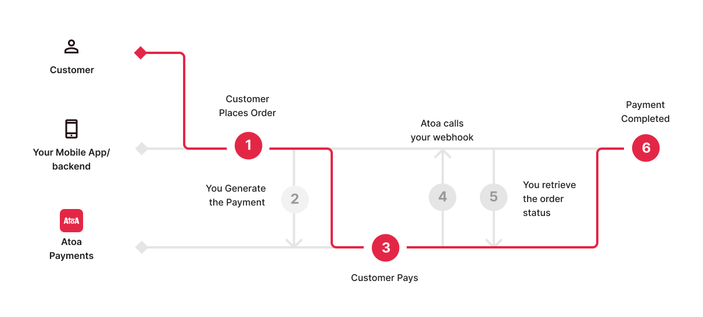

# Atoa Sdk

Flutter plugin for Atoa SDK.

[](https://pub.dartlang.org/packages/atoa_flutter_sdk)
[![style: very good analysis][very_good_analysis_badge]][very_good_analysis_link]
[![License: MIT][license_badge]][license_link]


- [Installation](#installation)
- [Usage](#usage)
- [Example](https://github.com/ATOAPaymentsLimited/flutter_atoa_sdk/tree/main/example)
- [Complete Demo App](demo_app/lib/main.dart)
- [Handle Redirection](#handle-redirection-optional) (Optional)

| Please refer our official flutter documentation [here](https://docs.atoa.me/).

## Installation

Run following to add Atoa SDK to your flutter project

```sh
flutter pub add atoa_flutter_sdk
```

## Usage

Sample code to integrate can be found in [example/lib/main.dart](example/lib/main.dart).

#### Import package

```dart
import 'package:atoa_flutter_sdk/atoa_flutter_sdk.dart';
```

#### Show Payment Dialog

It's a full screen dialog which shows all the available bank list then once user selects the bank. They will be redirected to their bank app or website.

```dart
final paymentDetails = await AtoaSdk.show(
  context,
  paymentId: '<payment-request-id>',
  env: AtoaEnv.prod, /// or AtoaEnv.sandbox
);
```

#### Handle Response

```dart
if (paymentDetails != null) {
  if(paymentDetails.isCompleted) {
    // handle success
  } else {
    // handle failure / pending statuses
  }
} else {
// Bottom sheet was dismissed or encountered an error
}
```

## Handle Redirection (Optional)

Call the [payment-process](https://docs.atoa.me/api-reference/Payment/process-payment) API to generate a payment. In response, store the `paymentRequestId` on the backend. The `redirectUrl`, which can be passed as body parameters, redirects to your website and then opens your app via deep linking.

#### Resources For deep-linking

- [Flutter Docs](https://docs.flutter.dev/ui/navigation/deep-linking)
- [Code With Andrea](https://codewithandrea.com/articles/flutter-deep-links/)

For any issues or inquiries, please contact hello@paywithatoa.co.uk.

[very_good_analysis_link]: https://pub.dev/packages/very_good_analysis
[very_good_analysis_badge]: https://img.shields.io/badge/style-very_good_analysis-B22C89.svg
[license_badge]: https://img.shields.io/badge/license-MIT-blue.svg
[license_link]: https://opensource.org/licenses/MIT
